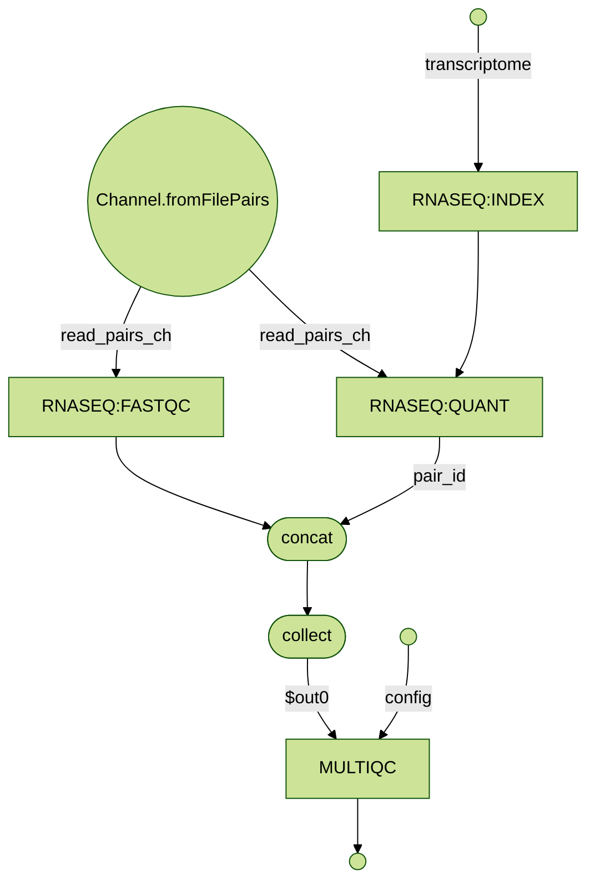

# fixme-nf pipline 

A basic (broken) genomic pipeline edited from nextflow.io. 

# Requirments 

* Unix-like operateing system (Linux, macOS, etc)
* Java 11 

## Quicksrtat 

1. If you don't have it allready install Docker in your computor. Read more [here](https://docs.docker.com/).

2. Install Nextflow (version 23.10.0 or later):
      
        conda activate uleth_advanced_bioinfo

3. Launch the pipeline execution with docker: 

        nextflow run uleth-advanced-bioinformatics/fixme-nf -with-docker

   or conda:

        nextflow run uleth-advanced-bioinformatics/fixme-nf -with-conda

4. When the execution completes open in your browser the report generated at the following path:

        results/multiqc_report.html 
	
You can see an example report at the following [link](http://multiqc.info/examples/rna-seq/multiqc_report.html).	
	
Note: the very first time you execute it, it will take a few minutes to download the pipeline 
from this GitHub repository and the associated Docker images needed to execute the pipeline.  

## Pipeline flowchart!!!!1!!!1!

Here is a visual representation of the design of fixme-nf pipeline, generated using the [visualization functionality](https://www.nextflow.io/docs/latest/tracing.html#dag-visualisation) of Nextflow.

## Cluster support

fixme-nf execution relies on [Nextflow](http://www.nextflow.io) framework which provides an 
abstraction between the pipeline functional logic and the underlying processing system.

This allows the execution of the pipeline in a single computer or in a HPC cluster without modifying it.

Currently the following resource manager platforms are supported:

  + Univa Grid Engine (UGE)
  + Platform LSF
  + SLURM
  + PBS/Torque

By default the pipeline is parallelized by spawning multiple threads in the machine where the script is launched.

To submit the execution to a UGE cluster create a file named `nextflow.config` in the directory
where the pipeline is going to be executed with the following content:

    process {
      executor='uge'
      queue='<queue name>'
    }

To lean more about the avaible settings and the configuration file read the 
Nextflow [documentation](http://www.nextflow.io/docs/latest/config.html).

## Components 

fixme-nf uses the following software components and tools: 

* [Salmon](https://combine-lab.github.io/salmon/)
* [FastQC](https://www.bioinformatics.babraham.ac.uk/projects/fastqc/)
* [MultiQC](https://multiqc.info)

